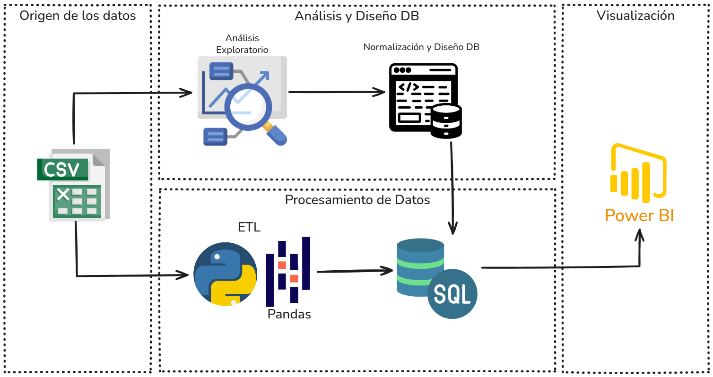
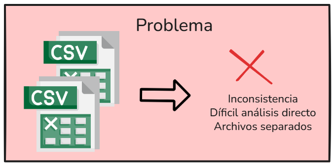
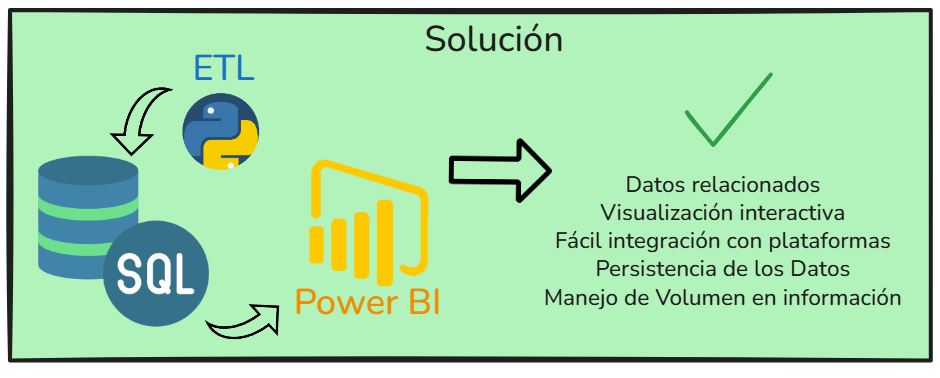
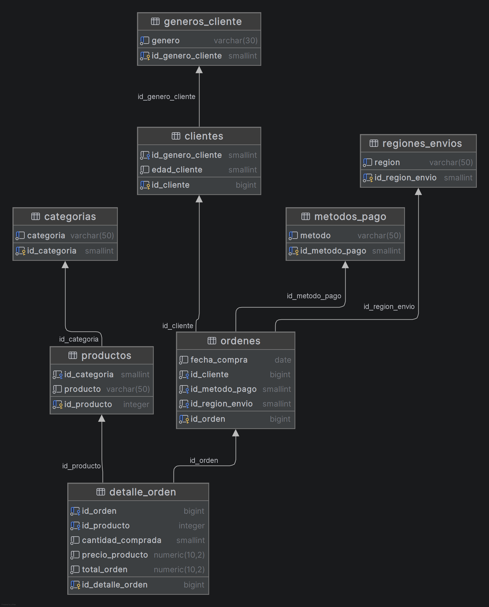

# Análisis de Clientes y Ventas

En este proyecto se utilizaron diferentes tecnologías como:

- Google Collab
- Python y Pandas
- PostgreSQL
- Power BI 
- Excalidraw para diagramas

## Workflow del Proyecto



## Problema a resolver



El cliente tiene los datos en dos archivos de Excel, el primero llamado Base de Datos (contiene información de productos y ventas) el segundo llamado Clientes (contiene información básica de los clientes). 

Estos dos archivos tiene relación entre sí, pero los datos no están bien estructurados y no se sabe si hay datos vacíos, el cliente comenta que quiere tener información sobre sus ventas, productos y clientes para entender como va el negocio y tomar decisiones en base a ellos. 

También el cliente quiere que los datos se organicen de mejor manera, de forma profesional ya que las ventas y los productos van aumentando conforme el paso del tiempo y se ha vuelto dificil mantenerlos en archivos de Excel. 

## Solución Propuesta



Como solución, se hará una limpieza y estandarización de los datos, se reemplazarán los archivos de Excel por una Base de Datos relacional, entregando el Diagrama Entidad Relación para que pueda ser implementado posteriormente en un sistema. Además se realizará un Dashboard en Power BI para entender las ventas, los productos y otros indicadores, el Dashboard en Power BI será claro e interactivo para que el cliente pueda ver y entender de forma fácil y pueda tomar las decisiones en base a la información organizada.

La solución se realizará de la siguiente forma:

1. Realizar un Análiss Exploratorio para entender el estado de los datos en los archivos proporcionados.

2. Diseñar una Base de Datos Relacional basada en los datos actuales para poder realizar consultas SQL y poder insertar, actualizar así como mantener los datos y lograr integraciones con otras plataformas de forma sencilla en el futuro. 

3. Crear un Dashboard claro e interactivo en Power BI que ayude a tomar decisiones para el negocio. 

4. Entregar la documentación al cliente, con un análisis y conclusiones que ayuden a entender su información actual.

## Analisis Exploratorio

El análisis detallado se puede encontrar en el siguiente documento: [Análisis Exploratorio Detallado](./docs/01_analisis_exploratorio.md). 

A continuación se muestran los resultados del EDA (Exploration Data Analysis).

### Archivos

- **Archivos Analizados**: base_de_datos.csv, clientes.csv

- **Columnas vacías:** En el archivo base_de_datos.csv se encontraron 2 columnas vacías. "Género del cliente" y "Edad del cliente".

- **Tipos de datos incorrectos:** En el archivo base_de_datos.csv las columnas "Fecha de compra", "Precio del producto" y "Total de la orden" están guardados como cadenas de texto. Deberían estar en tipo Fecha y en tipos Númericos. 

### Integridad de los datos 

En el archivo base_de_datos.csv se tiene el campoc "ID de la orden" como identificador, en el archivo clientes.csv se identificó el campo "ID del cliente", ambos archivos manejan integridad al no haber encontrado registros duplicados. 

### Resumen

Se mostró que el archivo principal tiene 20,000 registros con integriad en clave primaria, existen datos en 2 de las 12 columnas que conteien. Los datos faltantes pertencen al archivo secundario, estos pueden ser relacionados con su clave primaria. 

También se identificaron incongruencias en tipos de datos, esto sugiere una transformación posterior para asegurar la validez de cálculos, consultas y análisis a futuro. 

Hay relación entre los clientes únicos del archivo principal y el total de registros en el archivo secundario clientes.csv, esto confirma la referencia entre ambos conjuntos de datos

## Diseño de la base de Datos

A partir de los archivos proporcionados por el cliente y los resultados del Análisis Exploratorio, se decidió diseñar una base de datos relacional, aplicando normalización para reducir la redundancia y mantener integridad.

El diseño completo de la base de datos se encuentra en el siguiente documento: [Normalización y Diseño detallado](./docs/02_normalizacion_diseño_db.md)

### Normalización

Se refiere a organizar la información en tablas estructuradas. Esto ayuda a repetir datos y reduciendo el espacio ocupado. También ayuda a que los datos sean precisos y coherentes a lo largo del tiempo. 

### Diseño relacional

A partir de la normalización, pasamos de tener un archivo CSV principal con 12 columnas y un archivo secundario con 3 columnas hacia una base de datos relacional con 8 tablas. 

Esto permite consultar información, insertar, eliminar y actualizar datos, brindando un mejor manejo y persistencia optima. 

Diagrama entidad relación: 




## ETL con Python

Para este proyecto se eligío la siguiente estructura:

```Shell
VentasClientes/
│
├── data/                       # Origen y destino de los datos (nunca modificar los originales)
│   ├── raw/                    # Datos originales en su formato inicial
│   ├── clean/                  # Datos limpios y listos para el análisis
│   └── tables_csv/             # Tablas listas para cargar a la base de datos (1 archivo por tabla)
│
├── src/                        # Código del proyecto
│   ├── cleaning.py             # Funciones encargadas de eliminar columnas vacías, limpiar espacios
│   ├── transformation.py       # Funciones para cambiar tipos de datos
│   └── load_preparation.py     # Funciones para convertir los datos limpios en archivos separados para la carga
│   └── loading.py              # Funciones para cargar y verificar los datos cargados en DB
```

### Extracción de datos

El origen de los datos corresponde a los dos archivos CSV proporcionados por el cliente.

```Python
    df_base: DataFrame = load_data(BASE_PATH)
    df_clientes: DataFrame = load_data(CLIENTES_PATH)
```

### Transformación

El análisis exploratorio realizado previamente, sirvió para establecer cuales eran las columnas a remover, así como cuales serían las columnas que deben cambiar el tipo de dato.

El código solo afecta a las columnas con datos relevantes a cambiar. Luego los datos transformados y limpios fueron guardados en un nuevo archivo CSV. Esto solo se aplicó al archivo principal **base_de_datos.csv** ya que el secundario **clientes.csv** no contenía datos a cambiar.


```Python

    columnsToRemove: list[str] = ['Género del cliente', 'Edad del cliente']

    # CLEAN
    df_base = remove_empty_cols(columnsToRemove,df_base)
    df_base = clean_strings_cols(df_base)
    print("The data has been cleaned.\n\n")

    # TRANSFORM 
    df_base = convert_object_to_date(df_base, column_fecha_compra)
    df_base = convert_object_to_float(df_base, column_precio_producto)
    df_base = convert_object_to_float(df_base, column_total_orden)

    save_clean_csv(CLEAN_BASE_PATH, df_base)
```

## Carga de Datos

Antes de cargar los datos en la base de datos PostgreSQL se guardó un archivo CSV por cada tabla en la base de datos, esto simplifica el código para cargar y conectar a la base. 

```Python
    # LOAD
    # Preparar tables CSV
    tables = create_tables(df_base, df_clientes)
    save_tables(tables, TABLES_CSV_PATH)

    # Carga a la base de datos
    upload_data()
    verify_upload()
```

### Resultado del flujo completo ETL:

```Shell
The column Total de la orden doesn't have incosistent values
The file data/clean/base_de_datos_clean.csv exists. It will be replaced.
The specified data has been transformed
The file data/tables_csv exists. It will be replaced.
The CSV tables are now ready.
Cleaning Existing Tables...
Cargando generos_cliente desde generos_cliente.csv...
Cargando categorias desde categorias.csv...
Cargando metodos_pago desde metodos_pago.csv...
Cargando regiones_envios desde regiones_envios.csv...
Cargando clientes desde clientes.csv...
Cargando productos desde productos.csv...
Cargando ordenes desde ordenes.csv...
Cargando detalle_orden desde detalle_orden.csv...
All tables have been successfully loaded

=== LOAD VERIFICATION ===
generos_cliente     :      3 registros
categorias          :      6 registros
metodos_pago        :      5 registros
regiones_envios     :      5 registros
clientes            :   1987 registros
productos           :     18 registros
ordenes             :  20000 registros
detalle_orden       :  20000 registros
```